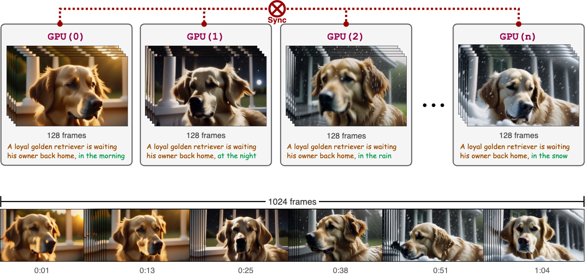

# Video-Infinity


 


> **Video-Infinity: Distributed Long Video Generation**
> <br>
> Zhenxiong Tan, 
> [Xingyi Yang](TODO), 
> [Songhua Liu](TODO), 
> and 
> [Xinchao Wang](TODO)
> <br>
> [Learning and Vision Lab](TODO), National University of Singapore
> <br>

## TL;DR (Too Long; Didn't Read)
Video-Infinity generates long videos quickly using multiple GPUs without extra training. Feel free to visit our 
[project page](https://video-infinity.tanzhenxiong.com/)
 for more information and generated videos.


## Features
* **Distributed 🌐**: Utilizes multiple GPUs to generate long-form videos.
* **High-Speed  🚀**: Produces 2,300 frames (3.5 minutes) in just 5 minutes.
* **Training-Free 🎓**: Generates long videos without requiring additional training for existing models.

## Setup
### Installation Environment
```bash
conda create -n video_infinity_vc2 python=3.10
conda activate video_infinity_vc2
pip install -r requirements.txt
```
<!-- ### Download Pretrained Models
We provide a diffusers pipeline for [VideoCrafter2](TODO) to generate long videos.
```bash
huggingface-cli download adamdad/videocrafterv2_diffusers
``` -->

## Usage
### Quick Start
- **Basic Usage**
```bash
python inference.py --config examples/config.json
```
- **Multi-Prompts**
```bash
python inference.py --config examples/multi_prompts.json
```
- **Single GPU**
```bash
python inference.py --config examples/single_gpu.json
```

### Config
#### Basic Config
| Parameter   | Description                            |
| ----------- | -------------------------------------- |
| `devices`   | The list of GPU devices to use.        |
| `base_path` | The path to save the generated videos. |

#### Pipeline Config
| Parameter    | Description                                                                                          |
| ------------ | ---------------------------------------------------------------------------------------------------- |
| `prompts`    | The list of text prompts. **Note**: The number of prompts should be greater than the number of GPUs. |
| `file_name`  | The name of the generated video.                                                                     |
| `num_frames` | The number of frames to generate on **each GPU**.                                                    |

#### Video-Infinity Config
| Parameter              | Description                                                                                                                                                                  |
| ---------------------- | ---------------------------------------------------------------------------------------------------------------------------------------------------------------------------- |
| `*.padding`            | The number of local context frames.                                                                                                                                          |
| `attn.topk`            | The number ofglobal context frames for `Attention` model.                                                                                                                    |
| `attn.local_phase`     | When the denoise timestep is less than `t`, it rebases the attention. This adds a `local_bias` to the local context frames and a `global_bias` to the global context frames. |
| `attn.global_phase`    | It is similar to `local_phase`. But it rebases the attention when the denoise timestep is greater than `t`.                                                                  |
| `attn.token_num_scale` | If the value is `True`, the scale factor will be rescaled by the number of tokens. Default is `False`. More details can be referred to this [paper](TODO).                   |
#### How to Set Config
- To avoid the loss of high-frequency information, we recommend setting the sum of `padding` and `attn.topk` to be less than 24 (which is similar to the number of the default frames in the `VideoCrafter2` model).
  - If you wish to have a larger `padding` or `attn.topk`, you should set the `attn.token_num_scale` to `True`.
- A higher `local_phase.t` and `global_phase.t` will result in more stable videos but may reduce the diversity of the videos.
- More `padding` will provide more local context.
- A higher `attn.topk` will bring about overall stability in the videos.

## Citation
```
@article{
  TODO
}
```

## Acknowledgements

